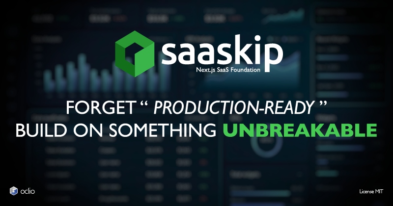
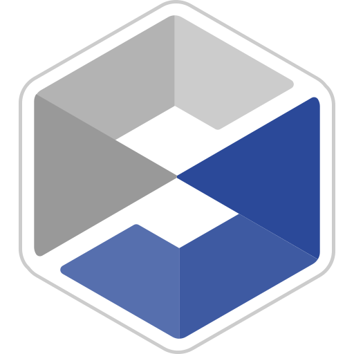

<div align="center">
<a href="https://sonarcloud.io/summary/new_code?id=oclio_saaskip"></a>
<a href="https://dashboard.stryker-mutator.io/reports/github.com/oclio/saaskip/main"></a>
<a href="https://sonarcloud.io/summary/new_code?id=oclio_saaskip"></a>
<a href="https://sonarcloud.io/summary/new_code?id=oclio_saaskip"></a>
<a href="https://sonarcloud.io/summary/new_code?id=oclio_saaskip"></a>
</div>

<br />

Stop debugging production. Start shipping with total confidence.

A resilient Next.js SaaS foundation built for serious projects. Hardened by strict tooling, exhaustive test suites, and mutation testing — with zero compromises on quality.

🚀 **[Live demo](https://saaskip.oclio.dev)** — explore the application in action.

📖 **[Full documentation](https://docs.saaskip.oclio.dev)** — architectures, features, and guides.

## Features

- **Security** — [Arcjet](https://arcjet.com) rate limiting & bot detection, CSP with nonce, CSRF protection, body size limit, secure cookies
- **Database** — PostgreSQL with [pgvector](https://github.com/pgvector/pgvector), [Drizzle ORM](https://orm.drizzle.team) with typed schemas and migrations, connection pooling, health-checked
- **Observability** — [Axiom](https://axiom.co) logging + [Sentry](https://sentry.io) error tracking, composable middleware chain, automatic web vitals reporting
- **Email** — [Resend](https://resend.com) + [React Email](https://react.email) templates, provider-agnostic mailer interface
- **i18n** — [next-intl](https://next-intl.dev) with locale-segmented routing, typed message bundles, persistent locale switcher
- **SEO** — per-locale metadata, `sitemap.xml`, `robots.txt`, web manifest, JSON-LD (`WebSite` + `Organization`)
- **Dark mode** — [`next-themes`](https://github.com/pacocoursey/next-themes), OKLCH color space, persists across reloads

## Stack

| Technology                                     | Role                                  |
| ---------------------------------------------- | ------------------------------------- |
| [Next.js](https://nextjs.org) 16               | App Router, Turbopack, React Compiler |
| [React](https://react.dev) 19                  | UI library                            |
| [TypeScript](https://www.typescriptlang.org) 6 | Type safety                           |
| [Tailwind CSS](https://tailwindcss.com) 4      | Styling                               |
| [shadcn/ui](https://ui.shadcn.com)             | Component system (base-lyra style)    |

## Requirements

| Tool    | Version                        |
| ------- | ------------------------------ |
| Node.js | >= 24.0.0                      |
| pnpm    | 11.20.0 (via `packageManager`) |

## Contributing

Contributions are welcome! See [`CONTRIBUTING.md`](.github/CONTRIBUTING.md) for guidelines and [`CODING_RULES.md`](.github/CODING_RULES.md) for coding conventions.

## Support the project

```text
As an: independent developer,
I want: to receive recurring funding,
So that: I can keep building tools you didn't know you needed.
```

<div align="center">
  <a href="https://github.com/sponsors/oclio"></a>
  <a href="https://buymeacoffee.com/oclio"></a>
</div>

## License

[MIT](LICENSE)

<p align="center">
  
</p>

<p align="center">
  <a href="https://oclio.dev">@oclio</a> — TypeScript Engineer<br>
  Lean, pragmatic, test-driven.
</p>
